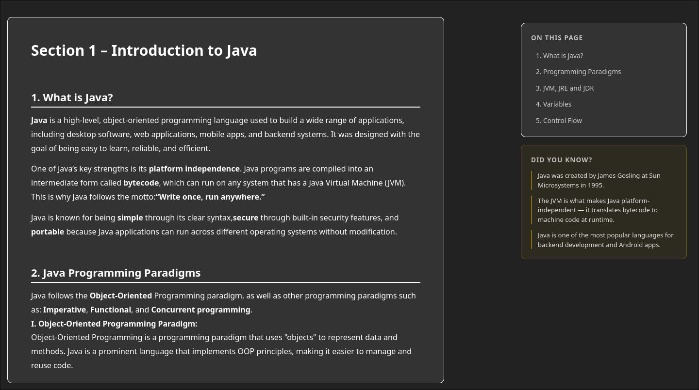
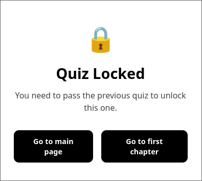
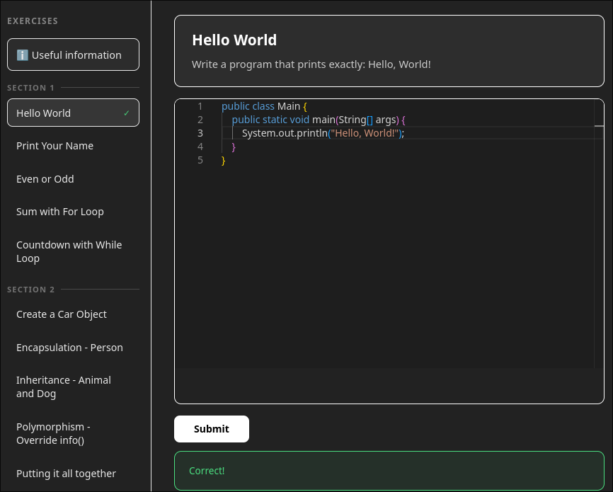

# 📚 Learn With eASE

> An interactive Java e-learning platform developed as a Bachelor's Degree Thesis.

Learn With eASE is a modern web application that helps students learn Java through structured lessons, interactive quizzes, hands-on coding exercises, and personalized study tools. The platform combines theory with practice to create an engaging learning experience for beginners and intermediate programmers.

---

# ✨ Features

## 🌗 Light & Dark Theme

Switch between light and dark mode to personalize your learning experience.

| Dark Mode | Light Mode |
|-----------|------------|
|  |  |

---

## 👤 Secure Authentication

Users can securely register and log into their accounts. Passwords are hashed before being stored in the database.

| Login | Register |
|--------|----------|
|  |  |

---

## 📚 Interactive Theory Lessons

The course is organized into **six progressive learning modules**, each containing structured explanations and Java code examples.

### Planned Improvements

- Direct navigation from each chapter to its corresponding quiz.



---

## 📝 Quiz System

Every learning module ends with an interactive quiz.

### Features

- Progress is automatically saved.
- Quiz completion is displayed on the user's profile.
- New quizzes unlock only after successfully completing the previous one.
- Planned "Congratulations" page after finishing every quiz.

### Quiz Passed


### Quiz Progress


### Locked Quiz



---

## 💻 Interactive Java Sandbox

Students can write and execute Java code directly inside the browser using **Judge0 API** and **Monaco Editor**.

Features include:

- Write Java code online
- Execute code safely
- Receive instant feedback
- Experiment without local setup



---

## 🗂️ Personal Flashcards

Logged-in users can create their own flashcards for revision.

Features:

- Create flashcards
- Delete flashcards
- Automatic persistence


---

## 📖 Learning Resources

A dedicated Resources page provides additional study materials.

Included resources:

- Useful websites
- Recommended books
- Official Java documentation
- Programming practice platforms


---

## 💬 Feedback System

Authenticated users can submit feedback about the platform.

All feedback is stored and displayed publicly to encourage continuous improvement.


---

# 📚 Learning Curriculum

## 1. Introduction to Java

- Introduction to Java
- JVM, JRE & JDK
- Platform Independence
- Variables & Data Types
- Control Flow
- Programming Paradigms

**Goal:** Build a solid foundation in Java programming.

---

## 2. Object-Oriented Programming

- Classes & Objects
- Encapsulation
- Inheritance
- Polymorphism
- Access Modifiers

**Goal:** Learn the core principles of object-oriented design.

---

## 3. Collections & Generics

- List
- Set
- Map
- Queue
- Iterators
- Generics

**Goal:** Understand Java's data structures and generic programming.

---

## 4. Streams, Lambdas & Exceptions

- Stream API
- Lambda Expressions
- Functional Interfaces
- Exception Handling
- try-catch-finally

**Goal:** Write cleaner, modern Java applications.

---

## 5. File Handling

- Text Files
- Binary Files
- JSON
- Serialization
- Try-with-resources

**Goal:** Learn how Java applications work with files and persistent data.

---

## 6. Networking

- Client-Server Architecture
- TCP
- UDP
- Java Sockets

**Goal:** Understand the basics of network programming.

---

# 🎯 Educational Objectives

Learn With eASE aims to:

- Provide a structured Java learning path.
- Combine theory with hands-on practice.
- Reinforce concepts using quizzes.
- Encourage experimentation through coding exercises.
- Prepare students for backend development.

---

# 🏗️ Tech Stack

| Layer | Technologies |
|--------|--------------|
| Frontend | React 19, JavaScript, Vite |
| Backend | Java 21, Spring Boot 4, Spring Security (JWT), Spring Data JPA, Hibernate |
| Database | PostgreSQL |
| Code Execution | Judge0 API, Monaco Editor |
| AI Assistant | Groq API |

---

# 🚀 Getting Started

## Frontend

```bash
cd frontend
npm install
npm run dev
```

---

## Backend

The backend requires **PostgreSQL**.

1. Install PostgreSQL (recommended tools: DBeaver or pgAdmin).
2. Configure the database credentials inside:

```
src/main/resources/application.properties
```

3. Create a PostgreSQL database.
4. Run the Spring Boot application.

---

## Optional AI Assistant

Navigate to the AI project:

```bash
cd ai-chat
```

Install dependencies:

```bash
pip install -r requirements.txt
```

Activate your virtual environment:

```bash
source venv/bin/activate.fish
```

Run the server:

```bash
uvicorn main:app --reload --port 8000
```

---

# 🌟 Highlights

- 🌗 Light & Dark mode
- 🔐 Secure JWT authentication
- 📚 Six structured Java learning modules
- 📝 Progressive quizzes with unlockable chapters
- 💻 Interactive Java coding sandbox
- 🗂️ Personalized flashcards
- 📖 Learning resources
- 💬 Public feedback system
- 🤖 Optional AI assistant
- ⚡ Built with React, Spring Boot & PostgreSQL