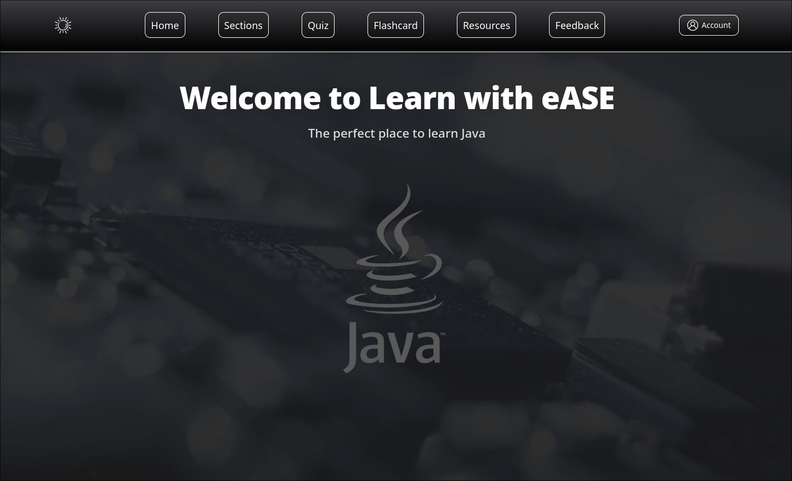
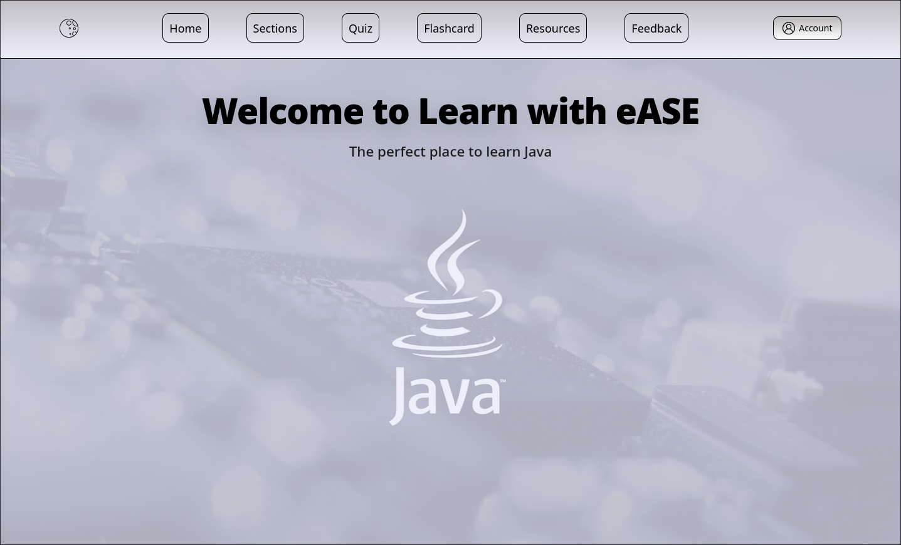
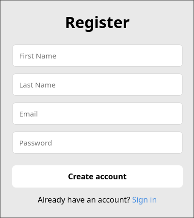
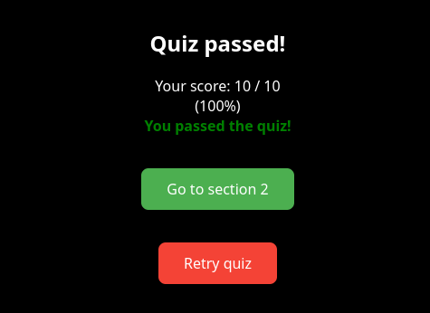
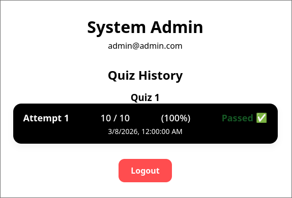
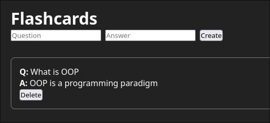
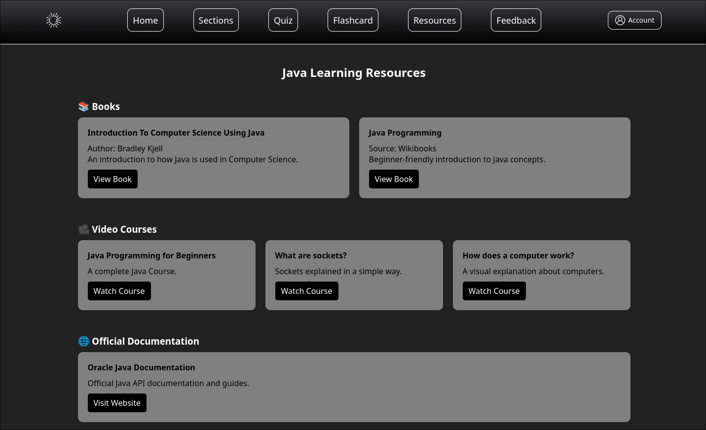
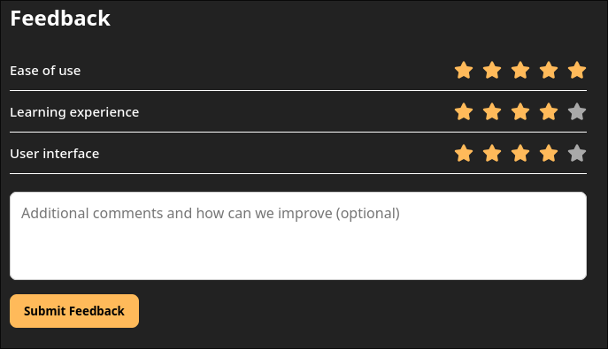

# Current platform functionalities

### Light/Dark theme support
* The platform supports switching from light to dark mode

### Account creation
* Login functionality - account stored in db and password securely hashed

* Register functionality - account creation and also stored in db with password securely hashed

### Theory section
* Six theory sections from where the user can learn
* TODO: have to add buttons to end of each section for the user to navigate to the quiz

### Quiz section
* Users can access quizzes for each section

* If the user is logged in the quiz progress is saved and displayed on their personal page
    * Progress is lost if the user does not have an account

* Users can only access next quiz if they successfully passed the previous one, else is blocked

* Upon successfully passing all quizzes, the user is redirected to a "congratulations" page (to do)

### Flashcard section (have to customize it but it is correctly working)
* The users can create, delete custom flashcards (persistent) only if logged in

* Future functionality -> the users will be able to use flashcards during coding exercises.

### Resources page

* A page with useful resources such as:
  * Links
  * Books
  * Official Documentation
  * Exercise Platforms

### Feedback page

* On this page users can leave feedback
* Future functionality -> the feedback will be displayed on the platform (only if user is logged in)