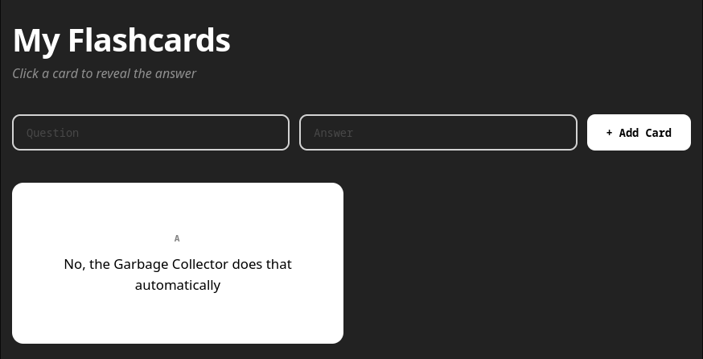

# ✨ Current Platform Features

## 🌗 Light & Dark Theme

The platform supports both **Light** and **Dark** themes, allowing users to choose the interface that best suits their preferences.

| Dark Mode | Light Mode |
|-----------|------------|
|  |  |

---

## 👤 User Authentication

### Login

Users can securely log into their accounts. Passwords are securely hashed before being stored in the database.

### Registration

New users can create an account, with all credentials securely stored using password hashing.

---

## 📚 Theory Section

The platform provides **six structured learning sections**, each covering a different Java topic through organized lessons and code examples.

**Planned improvement**
- Add navigation buttons at the end of each chapter to guide users directly to the corresponding quiz.

---

## 📝 Quiz System

Each learning section includes an interactive quiz to reinforce newly acquired knowledge.

### Features

- Progress is automatically saved for logged-in users.
- Quiz completion status is displayed on the user's profile.
- Users must successfully complete the previous quiz before unlocking the next one.
- A dedicated **Congratulations** page will be shown after completing all quizzes *(planned feature)*.

### Successfully Passed Quiz

### Quiz Progress

### Locked Quiz

---

## 💻 Interactive Coding Sandbox

Students can immediately apply what they learn using an integrated Java coding environment powered by **Judge0 API** and **Monaco Editor**.

Features include:

- Writing Java code directly in the browser
- Executing code safely inside an online sandbox
- Instant feedback and experimentation

---

## 🗂️ Flashcards

Logged-in users can create their own personalized flashcards to aid revision.

Features include:

- Create custom flashcards
- Delete flashcards
- Persistent storage linked to the user's account

---

## 📖 Resources Page

The platform includes a dedicated resources section containing useful learning materials, including:

- 🔗 Useful links
- 📚 Recommended books
- 📄 Official Java documentation
- 🧩 Programming practice platforms

---

## 💬 Feedback System

Authenticated users can leave feedback about the platform.

Submitted feedback is stored and displayed publicly, helping improve the learning experience through community input.

